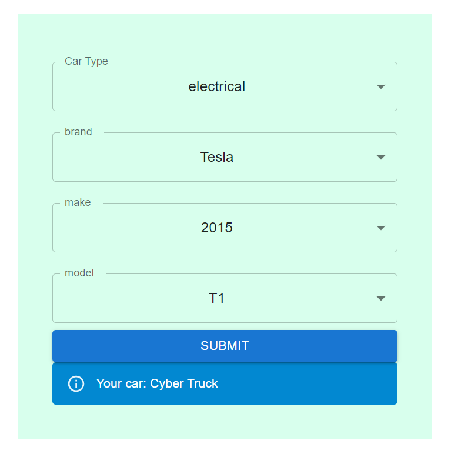
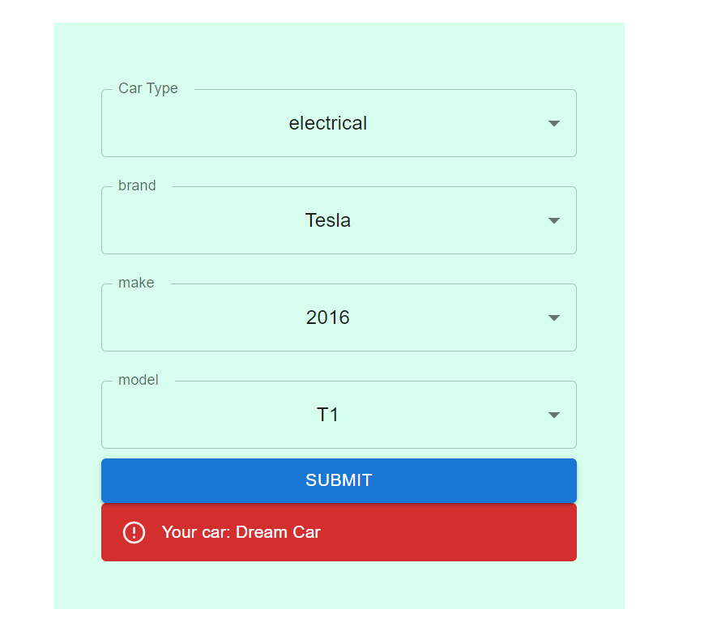

# Getting Started with React Car App

## Get Started
1. Clone the Repository on your local or launch it in the Gitpod.
2. In the root of the directory first run
```
npm i
```
3. After all the packages are installed, run
```
npm start
```
4. If all thing went perfect, you will be able to launch the project on `localhost:3000`.If you run into any  issues, please feel free to open an issue.
## Code Info
The dummy data of cars is stored under the `src/assets/cars.json`
A general structure looks like
```json
{
    "carType": [
        {
            name: "Car1",
            subProperty: "first",
            subProperty: "second",
            subProperty: "third"
        }
    ]
}
```
When a user selects from a dropdown one of three Car Types (electrical, 2 wheels or Sport). Another required sub car types selection becomes visible.
Which includes
1. Brand
2. Model
3. Make

After successful entry to all the fields, hit the "Submit" Button at the bottom of the form. If the Car with given specification exists it will give the Car name with a _Info_ alert, or else, an _error_ alert with the name **Dream Car**. 


## Available Scripts

In the project directory, you can run:

### `npm start`

Runs the app in the development mode.\
Open [http://localhost:3000](http://localhost:3000) to view it in your browser.

The page will reload when you make changes.\
You may also see any lint errors in the console.

### `npm test`

Launches the test runner in the interactive watch mode.\
See the section about [running tests](https://facebook.github.io/create-react-app/docs/running-tests) for more information.

### `npm run build`

Builds the app for production to the `build` folder.\
It correctly bundles React in production mode and optimizes the build for the best performance.

The build is minified and the filenames include the hashes.\
Your app is ready to be deployed!

See the section about [deployment](https://facebook.github.io/create-react-app/docs/deployment) for more information.

### `npm run eject`

**Note: this is a one-way operation. Once you `eject`, you can't go back!**

If you aren't satisfied with the build tool and configuration choices, you can `eject` at any time. This command will remove the single build dependency from your project.

Instead, it will copy all the configuration files and the transitive dependencies (webpack, Babel, ESLint, etc) right into your project so you have full control over them. All of the commands except `eject` will still work, but they will point to the copied scripts so you can tweak them. At this point you're on your own.

You don't have to ever use `eject`. The curated feature set is suitable for small and middle deployments, and you shouldn't feel obligated to use this feature. However we understand that this tool wouldn't be useful if you couldn't customize it when you are ready for it.

## Screenshots

<figure>

<figcaption>On a successful search the name appeared in the info Alert</figcaption>
</figure>

<figure>

<figcaption>The entered specs car does not exists in the database, and hence an Error alert is shown with the name "Dream Car"</figcaption>
</figure>

